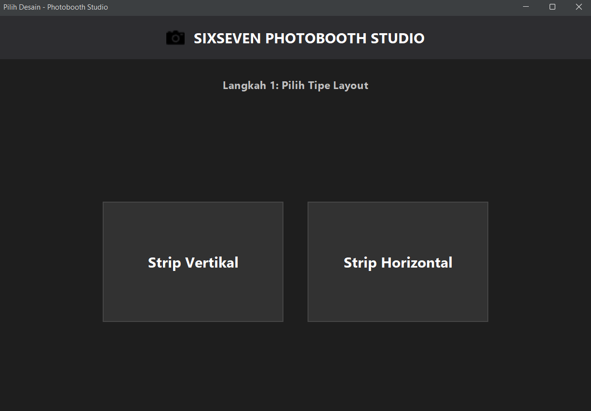
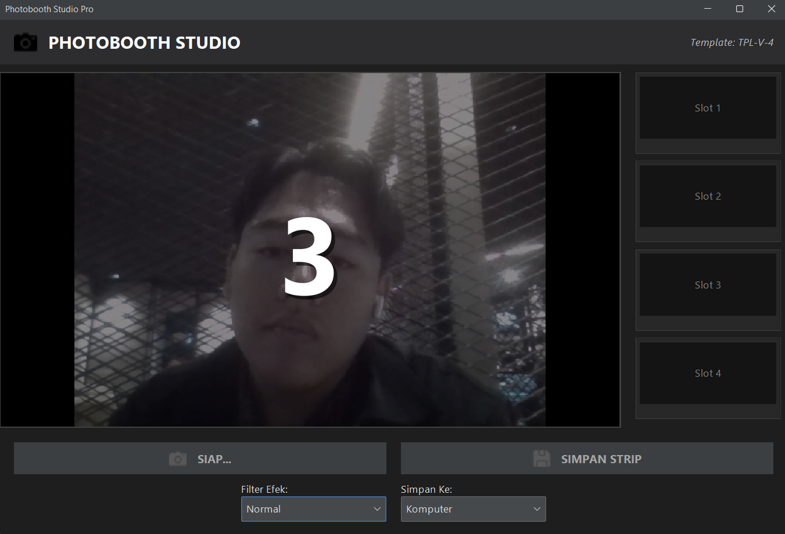
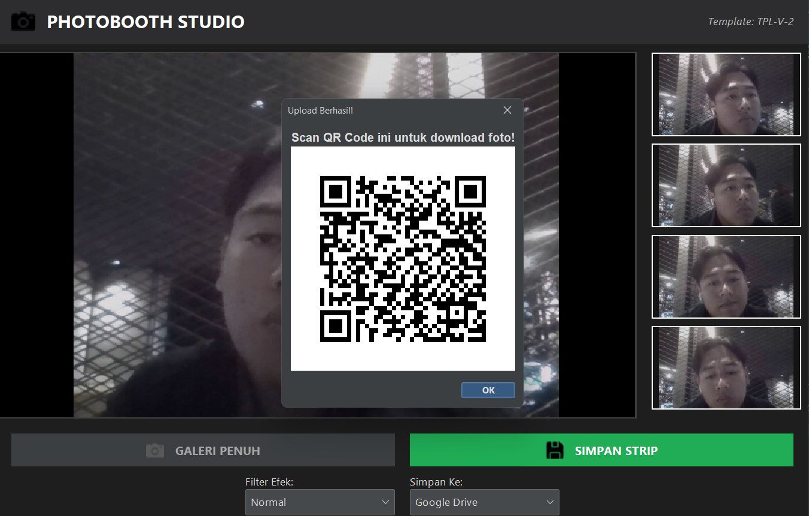

# 📸 SixSeven Photobooth Studio Pro


> Aplikasi Photobooth Desktop modern dengan fitur integrasi Cloud, QR Code, dan berbagai template estetis. Dibangun dengan konsep *Clean Architecture* dan *Object-Oriented Design Patterns*.

---

## ✨ Fitur Utama

Aplikasi ini bukan sekadar mengambil foto, tetapi memberikan pengalaman *photobooth* digital yang lengkap:

* **📸 Live Webcam Feed:** Pratinjau kamera real-time dengan hitungan mundur visual di layar.
* **🎨 Pilihan Jenis Template:** Mulai dari Strip Vertikal, Kotak 2x2, hingga layout Klasik.
* **🖼️ Filter Efek:** Pilihan filter *Normal* dan *Grayscale* (Hitam Putih) secara real-time.
* **☁️ Integrasi Google Drive:** Upload otomatis ke Cloud penyimpanan.
* **📱 QR Code Generator:** Pengguna cukup scan QR Code yang muncul untuk mengunduh foto langsung ke HP mereka.
* **💾 Simpan Lokal:** Opsi untuk menyimpan hasil foto ke komputer lokal.
* **🔊 Audio Feedback:** Efek suara shutter kamera saat pengambilan gambar.
* **🌑 Modern Dark UI:** Antarmuka elegan menggunakan FlatLaf Dark Theme.

---

## 🖼️ Tampilan Aplikasi

| Halaman Pemilihan Template | Live Kamera & Filter |
|:--------------------------:|:--------------------:|
|  |  |
| *Memilih jenis layout strip* | *Proses foto dengan countdown overlay* |

| Hasil QR Code |
|:-------------:|
|  |
| *Scan untuk download via Drive* |


---

## 🏗️ Arsitektur & Design Patterns

Proyek ini dibangun untuk memenuhi standar Tugas Besar Pemrograman Berorientasi Objek (PBO) dengan menerapkan **5 Design Patterns** utama:

### 1. Creational Patterns
* **Singleton (`CameraManager`):** Memastikan hanya ada satu instansi yang mengontrol akses ke hardware webcam untuk mencegah *crash*.
* **Factory Method (`TemplateFactory`):** Membuat objek template (`TemplateVertical`, `TemplateSquare`, dll) secara dinamis tanpa mengekspos logika pembuatan ke klien.

### 2. Structural Patterns
* **Facade (`PhotoboothService`):** Menyederhanakan kompleksitas sistem (Kamera, Factory, Export) menjadi satu antarmuka yang mudah digunakan oleh GUI.

### 3. Behavioral Patterns
* **Strategy (`ExportStrategy`):** Memungkinkan pengguna menukar algoritma penyimpanan (Simpan Lokal vs Upload Drive) saat runtime.
* **Strategy (`FilterStrategy`):** Memungkinkan penerapan algoritma manipulasi piksel (Filter warna) yang berbeda secara dinamis.

---

## 🛠️ Teknologi & Library

* **Bahasa:** Java (JDK 17+)
* **GUI Framework:** Java Swing
* **Look & Feel:** [FlatLaf](https://www.formdev.com/flatlaf/) (Dark Mode)
* **Hardware Access:** [Webcam Capture API](https://github.com/sarxos/webcam-capture)
* **Cloud API:** Google Drive API v3 & Google OAuth Client
* **QR Code:** ZXing (Zebra Crossing)
* **Audio:** Java Sound API

---

## 🚀 Cara Menjalankan (Installation)

### Prasyarat
1.  Java Development Kit (JDK) versi 8 atau lebih baru.
2.  Koneksi Internet (untuk fitur Google Drive).
3.  Webcam yang terhubung.

### Langkah-Langkah
1.  **Clone Repository:**
    ```bash
    git clone [https://github.com/username-anda/TubesPBO-Photobooth.git](https://github.com/username-anda/TubesPBO-Photobooth.git)
    ```
2.  **Setup Google Credentials:**
    * Dapatkan file `credentials.json` dari Google Cloud Console (OAuth 2.0 Client ID).
    * Letakkan file `credentials.json` di dalam folder `src/`.
    * *(Catatan: File ini di-ignore oleh git demi keamanan).*
3.  **Run Aplikasi:**
    * Buka project di VS Code / IntelliJ IDEA.
    * Jalankan file `src/MainApp.java`.

---

## 👥 Tim Pengembang

Proyek ini dikerjakan oleh Kelompok [Nama Kelompok] untuk memenuhi Tugas Besar PBO:

| Nama | Peran | Kontribusi Utama |
| :--- | :--- | :--- |
| **Umem** | **Project Lead & Integrator** | Frontend GUI, Google Drive API, QR Code, System Integration. |
| **Ibun** | **Backend & Hardware** | Camera Singleton, Photobooth Service, Core Logic. |
| **Ican** | **Logic & Visuals** | Template Factory, Filter Strategies, Image Processing. |

---

## 📜 Lisensi

Didistribusikan di bawah lisensi MIT. Lihat `LICENSE` untuk informasi lebih lanjut.

---
*Dibuat dengan ❤️ dan ☕ oleh Tim SixSeven Photobooth Studio Pro.*